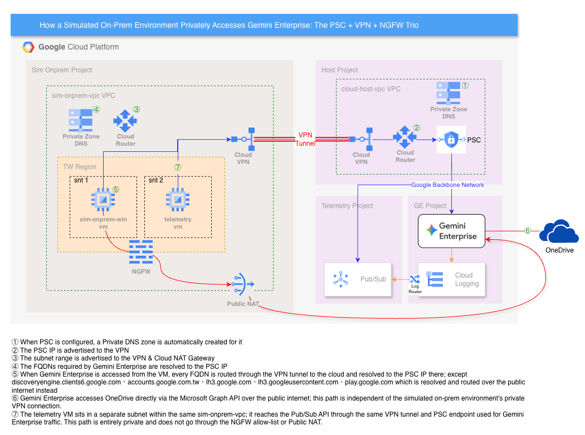
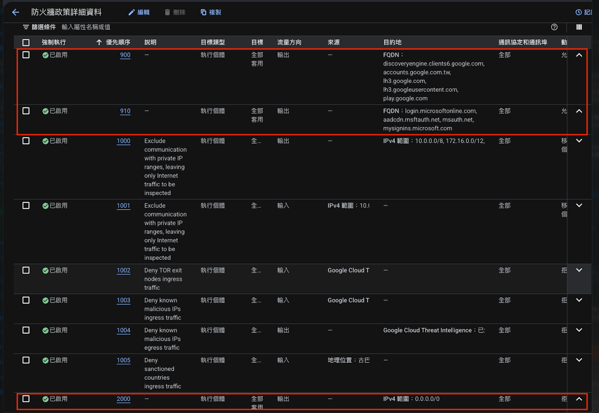
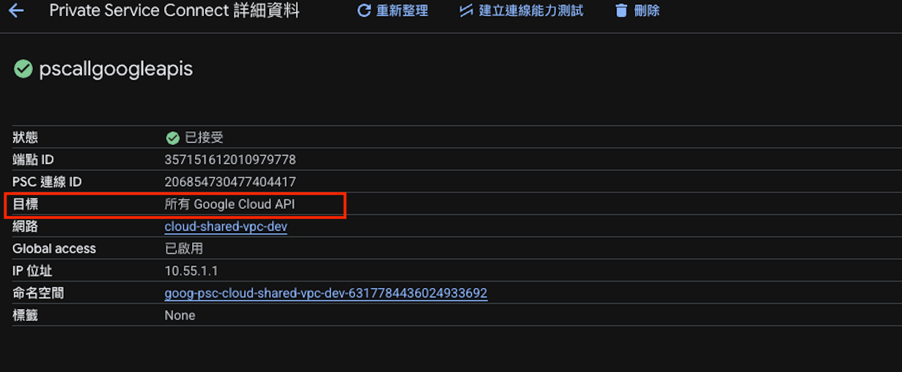
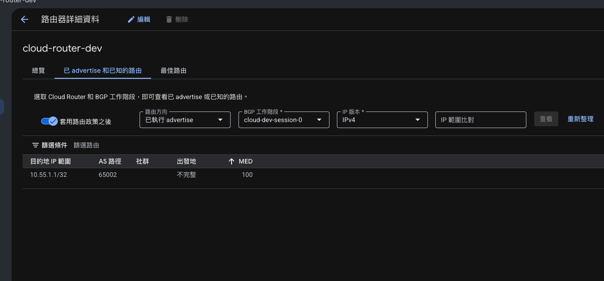
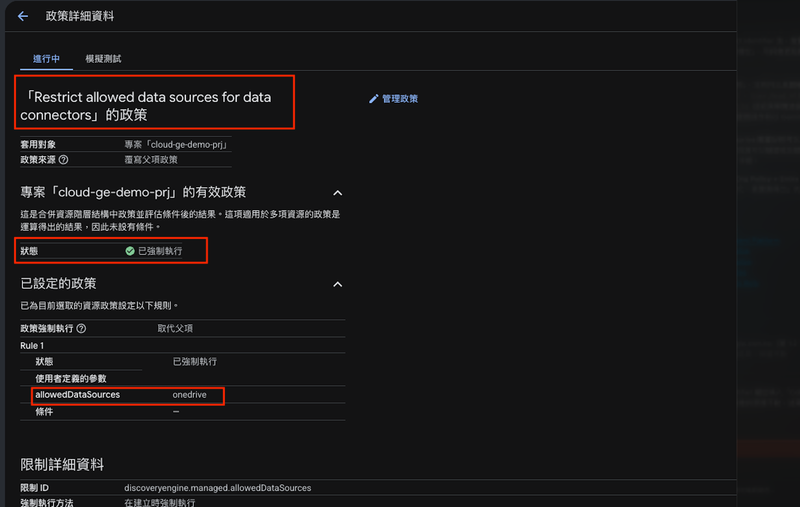
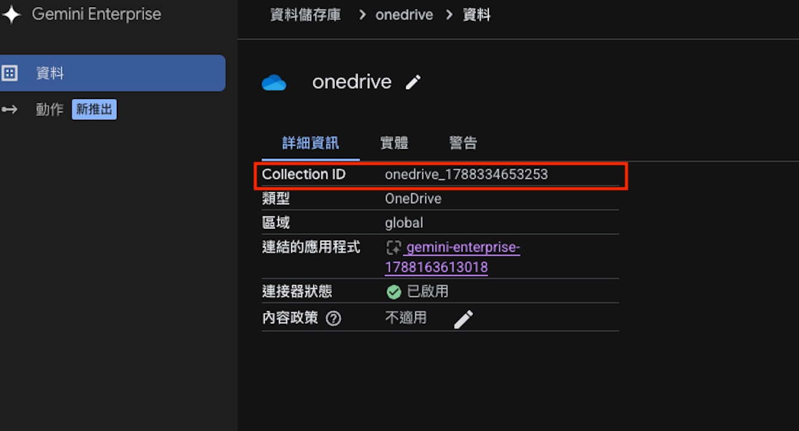
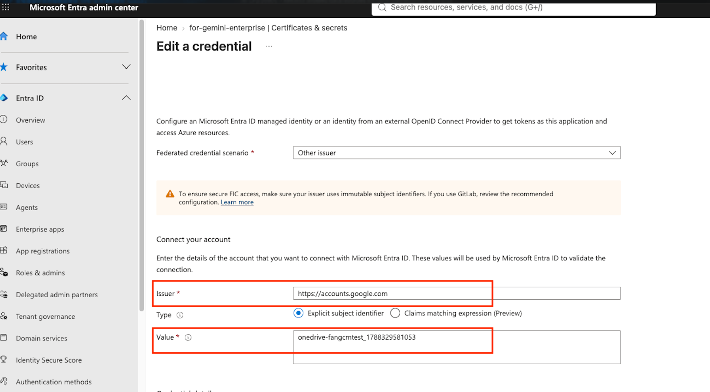
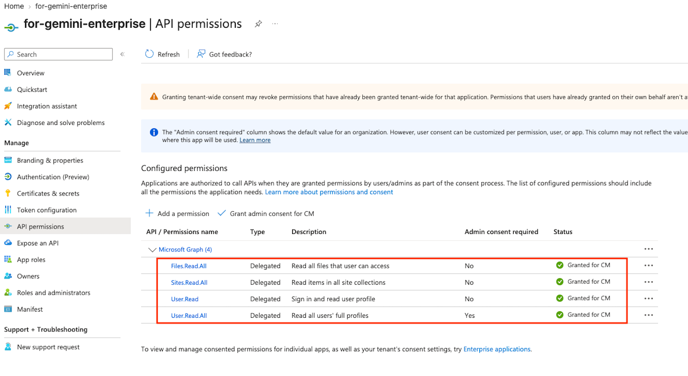
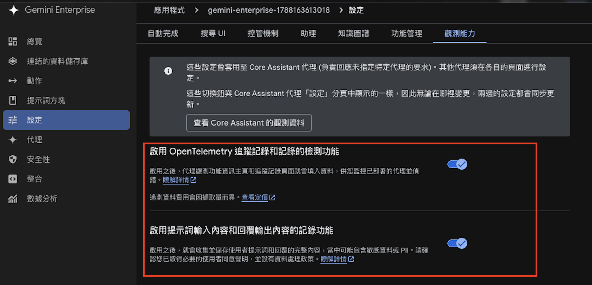
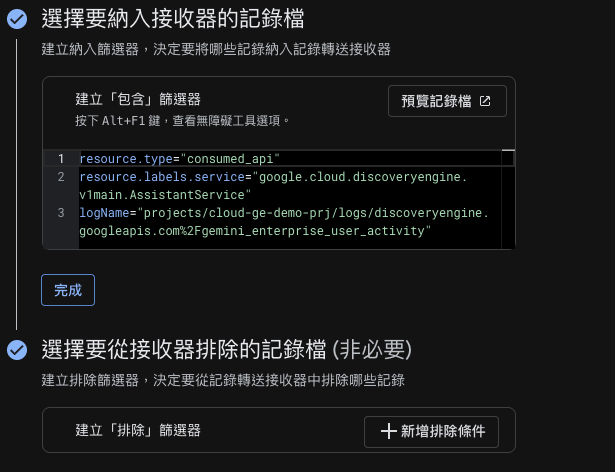

# 如何在 GCP 雲端仿造地端網路，透過 VPN 私有連線安全存取 Gemini Enterprise（Private Service Connect + VPC Service Controls 實作教學）

## TL;DR

在缺乏真實地端環境時，可在 GCP 建立兩個 VPC（模擬地端的 `sim-onprem-vpc` 與雲上的 `cloud-host-vpc`），透過 **Cloud VPN** 互連，並在雲上 VPC 建立 **Private Service Connect（PSC）** 指向 Google APIs，讓地端模擬環境完全不經公網、僅透過私有連線存取 **Gemini Enterprise**。再搭配 **VPC Service Controls（VPC SC）**、**Access Context Manager（ACM）** 卡控來源 IP，並設定 Org Policy 限制資料連接器來源，最後串接 **Microsoft OneDrive**（透過 Entra ID App Registration + Federated Credentials）作為 Gemini Enterprise 的 DataStore 資料源。

適合情境：企業導入 Gemini Enterprise 前，需要驗證「僅允許透過地端 VPN 私有連線存取，禁止公網存取」的資安需求，且尚無實體地端網路可供測試。



## 目錄

- [TL;DR](#tldr)
- [1. 建置一個 sim-onprem-vpc VPC 仿造地端網路環境](#1-建置一個-sim-onprem-vpc-vpc-仿造地端網路環境)
  - [1.1 建立地端網段與測試 VM](#11-建立地端網段與測試-vm)
  - [1.2 sim-onprem-vpc 防火牆設定](#12-sim-onprem-vpc-防火牆設定)
  - [1.3 建立 Cloud NAT（Public NAT）](#13-建立-cloud-natpublic-nat)
  - [1.4 建立 VPN Gateway & Tunnel（是否 HA VPN 不影響此 Lab）](#14-建立-vpn-gateway-tunnel是否-ha-vpn-不影響此-lab)
- [2. 建置另外一個 cloud-host-vpc VPC 當作 GCP 雲上網路環境](#2-建置另外一個-cloud-host-vpc-vpc-當作-gcp-雲上網路環境)
  - [2.1 建立 Private Service Connect（PSC）並設定指向所有 Google APIs](#21-建立-private-service-connectpsc並設定指向所有-google-apis)
  - [2.2 建立 VPN Gateway & Tunnel 並通告 PSC IP](#22-建立-vpn-gateway-tunnel-並通告-psc-ip)
- [3. 建置 Gemini Enterprise 專用 GCP Project 並啟用 Gemini Enterprise](#3-建置-gemini-enterprise-專用-gcp-project-並啟用-gemini-enterprise)
  - [3.1 Gemini Enterprise 需要完成員工身分設定才會出現專屬登入 URL](#31-gemini-enterprise-需要完成員工身分設定才會出現專屬登入-url)
- [4. 設定 VPC Service Controls（VPC SC）（選擇性建置項目）](#4-設定-vpc-service-controlsvpc-sc選擇性建置項目)
  - [4.1 需要卡控來源 IP，需要有 Access Context Manager（ACM）](#41-需要卡控來源-ip需要有-access-context-manageracm)
  - [4.2 設定要保護的 GCP Project、APIs 等等](#42-設定要保護的-gcp-projectapis-等等)
- [5. 修改 Project Level 的 Org Policy](#5-修改-project-level-的-org-policy)
  - [5.1 啟用資料連接器來源限制](#51-啟用資料連接器來源限制)
- [6. 建立 Gemini Enterprise Datastore](#6-建立-gemini-enterprise-datastore)
  - [6.1 建立 DataStore](#61-建立-datastore)
  - [6.2 建立 DataStore 與 OneDrive 連結](#62-建立-datastore-與-onedrive-連結)
- [7. 測試](#7-測試)
  - [7.1 驗證私有連線與登入流程](#71-驗證私有連線與登入流程)
  - [7.2 驗證功能](#72-驗證功能)
- [8. 使用 Cloud Logging Router 功能將 Gemini Enterprise Log 導入 Pub/Sub](#8-使用-cloud-logging-router-功能將-gemini-enterprise-log-導入-pubsub)
  - [8.1 確認 Gemini Enterprise App 已啟用 Log 紀錄功能](#81-確認-gemini-enterprise-app-已啟用-log-紀錄功能)
  - [8.2 建立 Pub/Sub 服務](#82-建立-pubsub-服務)
  - [8.3 於 Cloud Logging 新增 Log Router](#83-於-cloud-logging-新增-log-router)
- [9. 使用 Open Source ELK 接收 Pub/Sub 中的 Log 資料](#9-使用-open-source-elk-接收-pubsub-中的-log-資料)
- [關鍵字 / Keywords](#關鍵字-keywords)

---

## 1. 建置一個 sim-onprem-vpc VPC 仿造地端網路環境

### 1.1 建立地端網段與測試 VM

在 sim-onprem-vpc 中設定一個 subnet 當作一個地端網段，並在該 subnet 中開一台 Windows VM 稍後測試用。VM 不要有對外 IP，會使用 IAP 方式登入。

### 1.2 sim-onprem-vpc 防火牆設定

- 新增一個防火牆規則：Allow Ingress `35.235.240.0/20` TCP `3389`
- 新增一個防火牆政策，在政策中新增規則：
  - Allow Egress FQDN `discoveryengine.clients6.google.com`、`accounts.google.com.tw`、`lh3.google.com`、`lh3.googleusercontent.com`、`play.google.com`（這些 FQDN 無法被 PSC IP 解析，需要走外網）
  - Allow Egress FQDN `login.microsoftonline.com`、`aadcdn.msftauth.net`、`msauth.net`、`mysignins.microsoft.com`（有使用 Entra ID SSO 才需要）
  - Deny Egress `0.0.0.0/0`



### 1.3 建立 Cloud NAT（Public NAT）

VM 沒有對外 IP，因此 1.2 允許 Egress 的那幾組 FQDN（`discoveryengine.clients6.google.com` 等無法被 PSC IP 解析、需要走外網的網域）若沒有 NAT Gateway 是無法實際連上外網的。需要在 sim-onprem-vpc 建立一個 Cloud NAT（Public NAT），並將 subnet 範圍納入 NAT 的來源範圍，讓這些允許的 Egress 規則真正有出口可以連到 Internet。

### 1.4 建立 VPN Gateway & Tunnel（是否 HA VPN 不影響此 Lab）

> 備註：
> 1. 在 GCP 建立純雲端 VPN Session，先在一端建好後會得到「Cloud Router BGP IP」以及「對等 BGP IP」，再拿這兩個 IP 去建另外一邊 VPN 就可以。
> 2. 通告 VM 所在網段或 VM IP（/32）到 VPN。

## 2. 建置另外一個 cloud-host-vpc VPC 當作 GCP 雲上網路環境

### 2.1 建立 Private Service Connect（PSC）並設定指向所有 Google APIs



### 2.2 建立 VPN Gateway & Tunnel 並通告 PSC IP



## 3. 建置 Gemini Enterprise 專用 GCP Project 並啟用 Gemini Enterprise

### 3.1 Gemini Enterprise 需要完成員工身分設定才會出現專屬登入 URL

## 4. 設定 VPC Service Controls（VPC SC）（選擇性建置項目）

> 此節為選擇性建置項目，非本 Lab 驗證私有連線的必要條件；若企業需要額外卡控 API 存取來源 IP，可依需求建置。

### 4.1 需要卡控來源 IP，需要有 Access Context Manager（ACM）

### 4.2 設定要保護的 GCP Project、APIs 等等

## 5. 修改 Project Level 的 Org Policy

### 5.1 啟用資料連接器來源限制

將 Org policy「Restrict allowed data sources for data connectors」啟用並取代父項設定，設定 `allowedDataSources` 為 onedrive 或是其他資料源。



## 6. 建立 Gemini Enterprise Datastore

### 6.1 建立 DataStore

建立 DataStore 才會有 Gemini Enterprise 數據分析可以看。

### 6.2 建立 DataStore 與 OneDrive 連結

1. 先去 Entra ID 建立一個應用程式（APP）。完成後會得到「Application (client) ID」、「Secret key value」，也需要「Tenant ID」。APP 需要設定兩組 Redirect URL。
   參考：[entra-app-registration](https://docs.cloud.google.com/gemini/enterprise/docs/connectors/ms-onedrive/third-party-config#entra-app-registration)
2. 回到 Gemini Enterprise 建立 DataStore 的地方，設定流程大部分依照官方文件進行即可。連接器模型推薦選擇「聯合搜尋」。
   參考：[set-up-data-store](https://docs.cloud.google.com/gemini/enterprise/docs/connectors/ms-onedrive/set-up-data-store)
3. DataStore 建立完成後會有一組「Collection ID」，記下來回到 Entra ID 再次設定「Federated credentials」。

   

4. 到「Certificates & secrets」→「Federated credentials」→ 新增 Credential。資料依照下方文件填入，而在 Subject identifier 欄位填入「Collection ID」。
   參考：[add-fed-credentials](https://docs.cloud.google.com/gemini/enterprise/docs/connectors/ms-onedrive/third-party-config#add-fed-credentials)

   

5. API Permissions 需要開啟 `Files.Read.All`、`Sites.Read.All`、`User.Read.All`。如果允許從 GE 做增刪改，則還需要 `Files.ReadWrite.AppFolder`、`Files.ReadWrite`。

   

## 7. 測試

### 7.1 驗證私有連線與登入流程

登入 Windows VM，開啟瀏覽器確認無法連線到 Internet。再使用 Gemini Enterprise URL 前往頁面，過程中會經過 Google 授權登入以及 Entra ID SSO。

### 7.2 驗證功能

確認可以在對話頁面進行 AI 對話，再確認可以查詢到放在 OneDrive 中的文件。

## 8. 使用 Cloud Logging Router 功能將 Gemini Enterprise Log 導入 Pub/Sub

### 8.1 確認 Gemini Enterprise App 已啟用 Log 紀錄功能



### 8.2 建立 Pub/Sub 服務

在本次 Lab 中為更符合實際企業級 Landing zone 資源階層，另外創建 Telemetry 專用 Project 用來開立 Pub/Sub 服務。

### 8.3 於 Cloud Logging 新增 Log Router

主要是篩選器的部分要事先知道需要哪些 Log 資料進到 Pub/Sub。若不做資料篩選，會在 Data Transfer Out 有比較多費用產生。



## 9. 使用 Open Source ELK 接收 Pub/Sub 中的 Log 資料

### 9.1 建立 telemetry-demo-server VM 並安裝 ELK Stack

在 sim-onprem-vpc 中另外新增一個 subnet，建立一台 Ubuntu 22.04 VM（`telemetry-demo-server`，同樣不開對外 IP，透過 IAP 登入），跟 1.1 節的 `sim-onprem-win-vm` 同屬一個 Project、同一個 VPC，只是分屬不同 subnet。加入 Elastic 官方 APT 來源後，直接用套件管理器安裝 Elasticsearch、Logstash、Kibana（本次驗證版本為 8.19.21），三個服務都跑在同一台 VM 上：

- Elasticsearch：監聽 `9200`（HTTP）、`9300`（節點通訊）
- Logstash：監聽 `5044`（Beats input，範例用）、`9600`（monitoring API）
- Kibana：監聽 `5601`

> 這是 Lab 驗證用的精簡拓樸，正式環境建議依資料量將三個元件拆到不同節點，並規劃 Elasticsearch 叢集。

### 9.2 設定 Logstash Pipeline 訂閱 Pub/Sub

安裝 `logstash-input-google_pubsub` 這個 Logstash 官方外掛，並在 `/etc/logstash/conf.d/` 下新增一個 pipeline 設定檔，訂閱第 8 節建立的 Pub/Sub Subscription：

```
input {
  google_pubsub {
    project_id    => "<Telemetry 專用 Project ID>"
    topic         => "gemini-enterprise-log-collector"
    subscription  => "gemini-enterprise-log-collector-sub"
    codec         => "json"
  }
}

output {
  elasticsearch {
    hosts => ["http://localhost:9200"]
    index => "gcp-logs-%{+YYYY.MM.dd}"
  }
}
```

VM 使用預設的 Compute Engine 服務帳戶（`cloud-platform` scope）搭配 Application Default Credentials 認證，不需要額外下載金鑰檔；但要記得把該服務帳戶加到 Pub/Sub Subscription 所在專案，並授予 `Pub/Sub Subscriber` 角色，Logstash 才能實際拉到訊息。

### 9.3 驗證資料寫入與 Kibana 檢視

Pipeline 啟動後，可以用以下指令確認索引有持續產生、文件數增加：

```
curl -s localhost:9200/_cat/indices?v
```

會看到依日期切分的索引，例如 `gcp-logs-2026.09.09`。接著在 Kibana（`http://<VM 內網 IP>:5601`）建立對應的 Data View，就能檢視、搜尋、視覺化從 Gemini Enterprise 導出的使用紀錄（如查詢內容、回覆狀態、呼叫的 API 方法等）。

> ⚠️ 目前這台 Lab VM 的 `xpack.security.enabled` 設為 `false`，Elasticsearch／Kibana 都沒有帳號密碼驗證，僅靠「VM 沒有對外 IP、只能透過 IAP/VPC 內部連線」做隔離。若要正式上線，務必開啟 Elastic 內建的 security 功能（帳號密碼或 SSO）並加上 TLS，不能只依賴網路隔離。

## 關鍵字 / Keywords

GCP, Google Cloud, Gemini Enterprise, Cloud VPN, Private Service Connect (PSC), VPC Service Controls (VPC SC), Access Context Manager (ACM), Org Policy, Microsoft Entra ID, OneDrive Connector, Federated Credentials, SSO, Cloud Logging, Log Router, Pub/Sub, ELK, Elasticsearch, Logstash, Kibana, IAP, 私有連線, 地端網路模擬, 混合雲架構

